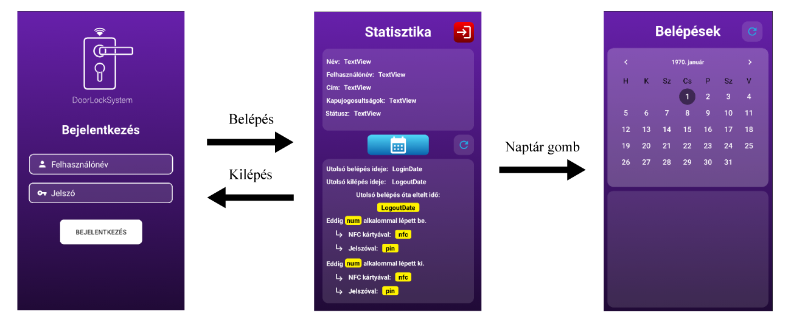

    

    <h1>DoorLockSystem</h1>
    <h3>Mobilapplikáció</h3>
    <h4>Szakdolgozat</h4>
     

---

    <h3>A projekt leírása:</h3>

- A szakdolgozat tematikájának részletesebb leírását, valamint az adatbázisban szerkezetét a <a href="https://github.com/galmihaly/DoorLock_System_Device">DoorLockSystemDevice</a> projekt tartalmazza.
- Az alkalmazás <b>Java</b>-ban készült.

---

    <h3>Az eszköz programjának grafikai megjelenése:</h3>

- A logót, valamint az alkalmazásban megtalálható összes ikont az <b>Adobe Illustrator</b> nevű program segítségével alkottam meg.
- Teljesen követi az eszköz grafikai megjelenését.
- Az alkalmazás grafikája (logót és design-t egybevéve) nem tartozik egyetlen valós céghez sem, csak a szakdolgozat érdekéken készítettem el.

---

     
    <h3>Az alkalmazás működése:</h3>

- A felhasználónak először be kell jelentkeznie az alkalmazásba (az adatbázisban megtalálható <b>tárolt eljárás</b> végzi el a hitelesítést)
- Ezt követően a <b>Statisztika</b> oldalon a bejelentkezett felhasználó meg tudja nézni a(z):
  - általános adatait (név, felhasználónév, lakcím)
  - kapujogosultságát (azt jelöli, hogy melyik eszközön van jogosultsága belépni az eszköz ID-ja alapján)
  - jelenlegi státuszát (aktív/inaktív státusza van-e az adatbázisban vagy sem)
  - utolsó belépés és kilépés dátumát
  - első regisztrációja óta mennyi alkalommal használta az eszköz PIN kódos, vagy RFID kártyás belépési módot.
- A frissítés gombbal (átettsző gomb, kék színű ikon) ismét lekérdezi az adatbázis tartalmát és frissíti a felületen található adatokat.
- A kijelentkezés gombbal (piros gomb, fehér színű ikon) ki tudunk jelentkezni az alkalmazásból.
- Ezt követően a Statisztika oldalon található naptár gombbal tovább tudunk menni a <b>Belépések</b> felületre, ahol napi szintre lebontva tudjuk megtekinteni a be és kilépéseinket.
- A frissítés gomb ezen a felületen is ugyanúgy működik, mint a Statisztika oldalon található frissítés gomb.

     
    
    
Az alkalmazás felületei és a köztük lévő navigáció

